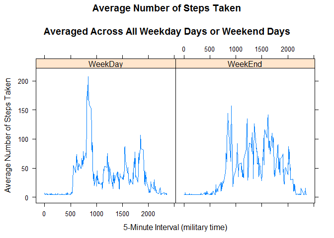

# Reproducible Research: Peer Assessment 1
Subramaniam  
January 9, 2016  
This is An R Markdown document to demonstrate ease of reproducability.  
  Here we are analyzing Human ACTIVITY data.  
  The activity data is captured at 5 min intervals and has the following fields *"steps", "date",  and "interval"*

The following analysis is incorporated in this document:

  1. Loading and preprocessing the data
  2. What is mean total number of steps taken per day?
  3. What is the average daily activity pattern?
  4. Imputing missing values
  5. Are there differences in activity patterns between weekdays and weekends?
  
###Libraries used  

```r
library(readr)
library(lubridate)
library(dplyr)
library(ggvis)
library(lattice)
```

Loading and Preprocessing


```r
activity_asis <- read_csv("~//RSourceData//activity.csv")
activity <- activity_asis[!is.na(activity_asis$steps),]
```

Calculating *mean* total number of steps taken per day

```r
activity %>%
  group_by(date) %>%
  summarise(Total_Number_Steps_PD = sum(steps)) -> Steps_PD

Steps_PD %>% ggvis(~date, ~Total_Number_Steps_PD, fill:="blue") %>% layer_bars() %>% add_axis("x", title = "Date") %>% add_axis("y", title = "Total Number Of Steps Per Day", title_offset = 50)
```

<!--html_preserve--><div id="plot_id458942980-container" class="ggvis-output-container">
<div id="plot_id458942980" class="ggvis-output"></div>
<div class="plot-gear-icon">
<nav class="ggvis-control">
<a class="ggvis-dropdown-toggle" title="Controls" onclick="return false;"></a>
<ul class="ggvis-dropdown">
<li>
Renderer: 
<a id="plot_id458942980_renderer_svg" class="ggvis-renderer-button" onclick="return false;" data-plot-id="plot_id458942980" data-renderer="svg">SVG</a>
 | 
<a id="plot_id458942980_renderer_canvas" class="ggvis-renderer-button" onclick="return false;" data-plot-id="plot_id458942980" data-renderer="canvas">Canvas</a>
</li>
<li>
<a id="plot_id458942980_download" class="ggvis-download" data-plot-id="plot_id458942980">Download</a>
</li>
</ul>
</nav>
</div>
</div>
<script type="text/javascript">
var plot_id458942980_spec = {
  "data": [
    {
      "name": ".0/count1/align2/stack3",
      "format": {
        "type": "csv",
        "parse": {
          "xmin_": "number",
          "xmax_": "number",
          "stack_upr_": "number",
          "stack_lwr_": "number"
        }
      },
      "values": "\"xmin_\",\"xmax_\",\"stack_upr_\",\"stack_lwr_\"\n1349092800000,1349179200000,126,0\n1349179200000,1349265600000,11352,0\n1349265600000,1.349352e+12,12116,0\n1.349352e+12,1349438400000,13294,0\n1349438400000,1349524800000,15420,0\n1349524800000,1349611200000,11015,0\n1349697600000,1.349784e+12,12811,0\n1.349784e+12,1349870400000,9900,0\n1349870400000,1349956800000,10304,0\n1349956800000,1350043200000,17382,0\n1350043200000,1350129600000,12426,0\n1350129600000,1.350216e+12,15098,0\n1.350216e+12,1350302400000,10139,0\n1350302400000,1350388800000,15084,0\n1350388800000,1350475200000,13452,0\n1350475200000,1350561600000,10056,0\n1350561600000,1.350648e+12,11829,0\n1.350648e+12,1350734400000,10395,0\n1350734400000,1350820800000,8821,0\n1350820800000,1350907200000,13460,0\n1350907200000,1350993600000,8918,0\n1350993600000,1.35108e+12,8355,0\n1.35108e+12,1351166400000,2492,0\n1351166400000,1351252800000,6778,0\n1351252800000,1351339200000,10119,0\n1351339200000,1351425600000,11458,0\n1351425600000,1.351512e+12,5018,0\n1.351512e+12,1351598400000,9819,0\n1351598400000,1351684800000,15414,0\n1351771200000,1351857600000,10600,0\n1351857600000,1.351944e+12,10571,0\n1352030400000,1352116800000,10439,0\n1352116800000,1352203200000,8334,0\n1352203200000,1352289600000,12883,0\n1352289600000,1.352376e+12,3219,0\n1352548800000,1352635200000,12608,0\n1352635200000,1352721600000,10765,0\n1352721600000,1.352808e+12,7336,0\n1352894400000,1352980800000,41,0\n1352980800000,1353067200000,5441,0\n1353067200000,1353153600000,14339,0\n1353153600000,1.35324e+12,15110,0\n1.35324e+12,1353326400000,8841,0\n1353326400000,1353412800000,4472,0\n1353412800000,1353499200000,12787,0\n1353499200000,1353585600000,20427,0\n1353585600000,1.353672e+12,21194,0\n1.353672e+12,1353758400000,14478,0\n1353758400000,1353844800000,11834,0\n1353844800000,1353931200000,11162,0\n1353931200000,1354017600000,13646,0\n1354017600000,1.354104e+12,10183,0\n1.354104e+12,1354190400000,7047,0"
    },
    {
      "name": "scale/x",
      "format": {
        "type": "csv",
        "parse": {
          "domain": "number"
        }
      },
      "values": "\"domain\"\n1348833600000\n1354449600000"
    },
    {
      "name": "scale/y",
      "format": {
        "type": "csv",
        "parse": {
          "domain": "number"
        }
      },
      "values": "\"domain\"\n0\n22253.7"
    }
  ],
  "scales": [
    {
      "name": "x",
      "domain": {
        "data": "scale/x",
        "field": "data.domain"
      },
      "type": "time",
      "clamp": false,
      "range": "width"
    },
    {
      "name": "y",
      "domain": {
        "data": "scale/y",
        "field": "data.domain"
      },
      "zero": false,
      "nice": false,
      "clamp": false,
      "range": "height"
    }
  ],
  "marks": [
    {
      "type": "rect",
      "properties": {
        "update": {
          "stroke": {
            "value": "#000000"
          },
          "fill": {
            "value": "blue"
          },
          "x": {
            "scale": "x",
            "field": "data.xmin_"
          },
          "x2": {
            "scale": "x",
            "field": "data.xmax_"
          },
          "y": {
            "scale": "y",
            "field": "data.stack_upr_"
          },
          "y2": {
            "scale": "y",
            "field": "data.stack_lwr_"
          }
        },
        "ggvis": {
          "data": {
            "value": ".0/count1/align2/stack3"
          }
        }
      },
      "from": {
        "data": ".0/count1/align2/stack3"
      }
    }
  ],
  "legends": [],
  "axes": [
    {
      "type": "x",
      "scale": "x",
      "orient": "bottom",
      "title": "Date",
      "layer": "back",
      "grid": true
    },
    {
      "type": "y",
      "scale": "y",
      "orient": "left",
      "title": "Total Number Of Steps Per Day",
      "titleOffset": 50,
      "layer": "back",
      "grid": true
    }
  ],
  "padding": null,
  "ggvis_opts": {
    "keep_aspect": false,
    "resizable": true,
    "padding": {},
    "duration": 250,
    "renderer": "svg",
    "hover_duration": 0,
    "width": 672,
    "height": 480
  },
  "handlers": null
};
ggvis.getPlot("plot_id458942980").parseSpec(plot_id458942980_spec);
</script><!--/html_preserve-->

The *mean* and *median* of the total number of steps taken per day

```r
mean(Steps_PD$Total_Number_Steps_PD)
```

```
## [1] 10766.19
```

```r
median(Steps_PD$Total_Number_Steps_PD)
```

```
## [1] 10765
```

The average daily activity pattern

```r
activity %>%
  group_by(interval) %>%
  summarise(Average_Across_Days = mean(steps)) -> Average_Steps_Per_Interval

Average_Steps_Per_Interval %>% 
  ggvis(~interval,~Average_Across_Days) %>%
  layer_lines()
```

<!--html_preserve--><div id="plot_id962858480-container" class="ggvis-output-container">
<div id="plot_id962858480" class="ggvis-output"></div>
<div class="plot-gear-icon">
<nav class="ggvis-control">
<a class="ggvis-dropdown-toggle" title="Controls" onclick="return false;"></a>
<ul class="ggvis-dropdown">
<li>
Renderer: 
<a id="plot_id962858480_renderer_svg" class="ggvis-renderer-button" onclick="return false;" data-plot-id="plot_id962858480" data-renderer="svg">SVG</a>
 | 
<a id="plot_id962858480_renderer_canvas" class="ggvis-renderer-button" onclick="return false;" data-plot-id="plot_id962858480" data-renderer="canvas">Canvas</a>
</li>
<li>
<a id="plot_id962858480_download" class="ggvis-download" data-plot-id="plot_id962858480">Download</a>
</li>
</ul>
</nav>
</div>
</div>
<script type="text/javascript">
var plot_id962858480_spec = {
  "data": [
    {
      "name": ".0/arrange1",
      "format": {
        "type": "csv",
        "parse": {
          "interval": "number",
          "Average_Across_Days": "number"
        }
      },
      "values": "\"interval\",\"Average_Across_Days\"\n0,1.71698113207547\n5,0.339622641509434\n10,0.132075471698113\n15,0.150943396226415\n20,0.0754716981132075\n25,2.09433962264151\n30,0.528301886792453\n35,0.867924528301887\n40,0\n45,1.47169811320755\n50,0.30188679245283\n55,0.132075471698113\n100,0.320754716981132\n105,0.679245283018868\n110,0.150943396226415\n115,0.339622641509434\n120,0\n125,1.11320754716981\n130,1.83018867924528\n135,0.169811320754717\n140,0.169811320754717\n145,0.377358490566038\n150,0.264150943396226\n155,0\n200,0\n205,0\n210,1.13207547169811\n215,0\n220,0\n225,0.132075471698113\n230,0\n235,0.226415094339623\n240,0\n245,0\n250,1.54716981132075\n255,0.943396226415094\n300,0\n305,0\n310,0\n315,0\n320,0.207547169811321\n325,0.622641509433962\n330,1.62264150943396\n335,0.584905660377358\n340,0.490566037735849\n345,0.0754716981132075\n350,0\n355,0\n400,1.18867924528302\n405,0.943396226415094\n410,2.56603773584906\n415,0\n420,0.339622641509434\n425,0.358490566037736\n430,4.11320754716981\n435,0.660377358490566\n440,3.49056603773585\n445,0.830188679245283\n450,3.11320754716981\n455,1.11320754716981\n500,0\n505,1.56603773584906\n510,3\n515,2.24528301886792\n520,3.32075471698113\n525,2.9622641509434\n530,2.09433962264151\n535,6.05660377358491\n540,16.0188679245283\n545,18.3396226415094\n550,39.4528301886792\n555,44.4905660377358\n600,31.4905660377358\n605,49.2641509433962\n610,53.7735849056604\n615,63.4528301886792\n620,49.9622641509434\n625,47.0754716981132\n630,52.1509433962264\n635,39.3396226415094\n640,44.0188679245283\n645,44.1698113207547\n650,37.3584905660377\n655,49.0377358490566\n700,43.811320754717\n705,44.377358490566\n710,50.5094339622642\n715,54.5094339622642\n720,49.9245283018868\n725,50.9811320754717\n730,55.6792452830189\n735,44.3207547169811\n740,52.2641509433962\n745,69.5471698113208\n750,57.8490566037736\n755,56.1509433962264\n800,73.377358490566\n805,68.2075471698113\n810,129.433962264151\n815,157.528301886792\n820,171.150943396226\n825,155.396226415094\n830,177.301886792453\n835,206.169811320755\n840,195.924528301887\n845,179.566037735849\n850,183.396226415094\n855,167.018867924528\n900,143.452830188679\n905,124.037735849057\n910,109.11320754717\n915,108.11320754717\n920,103.716981132075\n925,95.9622641509434\n930,66.2075471698113\n935,45.2264150943396\n940,24.7924528301887\n945,38.7547169811321\n950,34.9811320754717\n955,21.0566037735849\n1000,40.5660377358491\n1005,26.9811320754717\n1010,42.4150943396226\n1015,52.6603773584906\n1020,38.9245283018868\n1025,50.7924528301887\n1030,44.2830188679245\n1035,37.4150943396226\n1040,34.6981132075472\n1045,28.3396226415094\n1050,25.0943396226415\n1055,31.9433962264151\n1100,31.3584905660377\n1105,29.6792452830189\n1110,21.3207547169811\n1115,25.5471698113208\n1120,28.377358490566\n1125,26.4716981132075\n1130,33.4339622641509\n1135,49.9811320754717\n1140,42.0377358490566\n1145,44.6037735849057\n1150,46.0377358490566\n1155,59.188679245283\n1200,63.8679245283019\n1205,87.6981132075472\n1210,94.8490566037736\n1215,92.7735849056604\n1220,63.3962264150943\n1225,50.1698113207547\n1230,54.4716981132075\n1235,32.4150943396226\n1240,26.5283018867925\n1245,37.7358490566038\n1250,45.0566037735849\n1255,67.2830188679245\n1300,42.3396226415094\n1305,39.8867924528302\n1310,43.2641509433962\n1315,40.9811320754717\n1320,46.2452830188679\n1325,56.4339622641509\n1330,42.7547169811321\n1335,25.1320754716981\n1340,39.9622641509434\n1345,53.5471698113208\n1350,47.3207547169811\n1355,60.811320754717\n1400,55.7547169811321\n1405,51.9622641509434\n1410,43.5849056603774\n1415,48.6981132075472\n1420,35.4716981132075\n1425,37.5471698113208\n1430,41.8490566037736\n1435,27.5094339622642\n1440,17.1132075471698\n1445,26.0754716981132\n1450,43.622641509434\n1455,43.7735849056604\n1500,30.0188679245283\n1505,36.0754716981132\n1510,35.4905660377358\n1515,38.8490566037736\n1520,45.9622641509434\n1525,47.7547169811321\n1530,48.1320754716981\n1535,65.3207547169811\n1540,82.9056603773585\n1545,98.6603773584906\n1550,102.11320754717\n1555,83.9622641509434\n1600,62.1320754716981\n1605,64.1320754716981\n1610,74.5471698113208\n1615,63.1698113207547\n1620,56.9056603773585\n1625,59.7735849056604\n1630,43.8679245283019\n1635,38.5660377358491\n1640,44.6603773584906\n1645,45.4528301886792\n1650,46.2075471698113\n1655,43.6792452830189\n1700,46.622641509434\n1705,56.3018867924528\n1710,50.7169811320755\n1715,61.2264150943396\n1720,72.7169811320755\n1725,78.9433962264151\n1730,68.9433962264151\n1735,59.6603773584906\n1740,75.0943396226415\n1745,56.5094339622642\n1750,34.7735849056604\n1755,37.4528301886792\n1800,40.6792452830189\n1805,58.0188679245283\n1810,74.6981132075472\n1815,85.3207547169811\n1820,59.2641509433962\n1825,67.7735849056604\n1830,77.6981132075472\n1835,74.2452830188679\n1840,85.3396226415094\n1845,99.4528301886792\n1850,86.5849056603774\n1855,85.6037735849057\n1900,84.8679245283019\n1905,77.8301886792453\n1910,58.0377358490566\n1915,53.3584905660377\n1920,36.3207547169811\n1925,20.7169811320755\n1930,27.3962264150943\n1935,40.0188679245283\n1940,30.2075471698113\n1945,25.5471698113208\n1950,45.6603773584906\n1955,33.5283018867925\n2000,19.622641509434\n2005,19.0188679245283\n2010,19.3396226415094\n2015,33.3396226415094\n2020,26.811320754717\n2025,21.1698113207547\n2030,27.3018867924528\n2035,21.3396226415094\n2040,19.5471698113208\n2045,21.3207547169811\n2050,32.3018867924528\n2055,20.1509433962264\n2100,15.9433962264151\n2105,17.2264150943396\n2110,23.4528301886792\n2115,19.2452830188679\n2120,12.4528301886792\n2125,8.0188679245283\n2130,14.6603773584906\n2135,16.3018867924528\n2140,8.67924528301887\n2145,7.79245283018868\n2150,8.13207547169811\n2155,2.62264150943396\n2200,1.45283018867925\n2205,3.67924528301887\n2210,4.81132075471698\n2215,8.50943396226415\n2220,7.07547169811321\n2225,8.69811320754717\n2230,9.75471698113208\n2235,2.20754716981132\n2240,0.320754716981132\n2245,0.113207547169811\n2250,1.60377358490566\n2255,4.60377358490566\n2300,3.30188679245283\n2305,2.84905660377358\n2310,0\n2315,0.830188679245283\n2320,0.962264150943396\n2325,1.58490566037736\n2330,2.60377358490566\n2335,4.69811320754717\n2340,3.30188679245283\n2345,0.641509433962264\n2350,0.226415094339623\n2355,1.07547169811321"
    },
    {
      "name": "scale/x",
      "format": {
        "type": "csv",
        "parse": {
          "domain": "number"
        }
      },
      "values": "\"domain\"\n-117.75\n2472.75"
    },
    {
      "name": "scale/y",
      "format": {
        "type": "csv",
        "parse": {
          "domain": "number"
        }
      },
      "values": "\"domain\"\n-10.3084905660377\n216.478301886792"
    }
  ],
  "scales": [
    {
      "name": "x",
      "domain": {
        "data": "scale/x",
        "field": "data.domain"
      },
      "zero": false,
      "nice": false,
      "clamp": false,
      "range": "width"
    },
    {
      "name": "y",
      "domain": {
        "data": "scale/y",
        "field": "data.domain"
      },
      "zero": false,
      "nice": false,
      "clamp": false,
      "range": "height"
    }
  ],
  "marks": [
    {
      "type": "line",
      "properties": {
        "update": {
          "stroke": {
            "value": "#000000"
          },
          "x": {
            "scale": "x",
            "field": "data.interval"
          },
          "y": {
            "scale": "y",
            "field": "data.Average_Across_Days"
          }
        },
        "ggvis": {
          "data": {
            "value": ".0/arrange1"
          }
        }
      },
      "from": {
        "data": ".0/arrange1"
      }
    }
  ],
  "legends": [],
  "axes": [
    {
      "type": "x",
      "scale": "x",
      "orient": "bottom",
      "layer": "back",
      "grid": true,
      "title": "interval"
    },
    {
      "type": "y",
      "scale": "y",
      "orient": "left",
      "layer": "back",
      "grid": true,
      "title": "Average_Across_Days"
    }
  ],
  "padding": null,
  "ggvis_opts": {
    "keep_aspect": false,
    "resizable": true,
    "padding": {},
    "duration": 250,
    "renderer": "svg",
    "hover_duration": 0,
    "width": 672,
    "height": 480
  },
  "handlers": null
};
ggvis.getPlot("plot_id962858480").parseSpec(plot_id962858480_spec);
</script><!--/html_preserve-->

Which 5-minute interval, on average across all the days in the dataset, contains the maximum number of steps?

```r
filter(Average_Steps_Per_Interval, Average_Across_Days == max(Average_Steps_Per_Interval$Average_Across_Days))
```

```
## Source: local data frame [1 x 2]
## 
##   interval Average_Across_Days
##      (int)               (dbl)
## 1      835            206.1698
```

The total number of missing values in the dataset 

```r
activity_asis %>% filter (is.na(steps)) %>% summarise(Missing_Steps_Count = n())
```

```
## Source: local data frame [1 x 1]
## 
##   Missing_Steps_Count
##                 (int)
## 1                2304
```

Create a new dataset that is equal to the original dataset but with the missing data filled in. Assigning median of Average steps per interval to the missing values based on corresponding intervals

```r
activity_asis[is.na(activity_asis$steps), ]$steps <- median(Average_Steps_Per_Interval$Average_Across_Days)
```

Histogram of the total number of steps taken each day and Calculate and report the mean and median total number of steps taken per day. 

```r
activity_asis %>%
group_by(date) %>%
summarise(Total_Number_Steps_PD = sum(steps)) %>%
ggvis(~date,~Total_Number_Steps_PD,fill:="blue") %>%
layer_bars()%>% add_axis("x", title = "Date") %>% add_axis("y", title = "Total Number Of Steps Per Day (w/ NA Replaced)", title_offset = 50)

activity_asis %>%
group_by(date) %>%
summarise(Total_Number_Steps_PD = sum(steps))%>% summarize(Mean=mean(Total_Number_Steps_PD),Median=median(Total_Number_Steps_PD))
```
<!--html_preserve--><div id="plot_id459611028-container" class="ggvis-output-container">
<div id="plot_id459611028" class="ggvis-output"></div>
<div class="plot-gear-icon">
<nav class="ggvis-control">
<a class="ggvis-dropdown-toggle" title="Controls" onclick="return false;"></a>
<ul class="ggvis-dropdown">
<li>
Renderer: 
<a id="plot_id459611028_renderer_svg" class="ggvis-renderer-button" onclick="return false;" data-plot-id="plot_id459611028" data-renderer="svg">SVG</a>
 | 
<a id="plot_id459611028_renderer_canvas" class="ggvis-renderer-button" onclick="return false;" data-plot-id="plot_id459611028" data-renderer="canvas">Canvas</a>
</li>
<li>
<a id="plot_id459611028_download" class="ggvis-download" data-plot-id="plot_id459611028">Download</a>
</li>
</ul>
</nav>
</div>
</div>
<script type="text/javascript">
var plot_id459611028_spec = {
  "data": [
    {
      "name": ".0/count1/align2/stack3",
      "format": {
        "type": "csv",
        "parse": {
          "xmin_": "number",
          "xmax_": "number",
          "stack_upr_": "number",
          "stack_lwr_": "number"
        }
      },
      "values": "\"xmin_\",\"xmax_\",\"stack_upr_\",\"stack_lwr_\"\n1349006400000,1349092800000,9824.6037735849,0\n1349092800000,1349179200000,126,0\n1349179200000,1349265600000,11352,0\n1349265600000,1.349352e+12,12116,0\n1.349352e+12,1349438400000,13294,0\n1349438400000,1349524800000,15420,0\n1349524800000,1349611200000,11015,0\n1349611200000,1349697600000,9824.6037735849,0\n1349697600000,1.349784e+12,12811,0\n1.349784e+12,1349870400000,9900,0\n1349870400000,1349956800000,10304,0\n1349956800000,1350043200000,17382,0\n1350043200000,1350129600000,12426,0\n1350129600000,1.350216e+12,15098,0\n1.350216e+12,1350302400000,10139,0\n1350302400000,1350388800000,15084,0\n1350388800000,1350475200000,13452,0\n1350475200000,1350561600000,10056,0\n1350561600000,1.350648e+12,11829,0\n1.350648e+12,1350734400000,10395,0\n1350734400000,1350820800000,8821,0\n1350820800000,1350907200000,13460,0\n1350907200000,1350993600000,8918,0\n1350993600000,1.35108e+12,8355,0\n1.35108e+12,1351166400000,2492,0\n1351166400000,1351252800000,6778,0\n1351252800000,1351339200000,10119,0\n1351339200000,1351425600000,11458,0\n1351425600000,1.351512e+12,5018,0\n1.351512e+12,1351598400000,9819,0\n1351598400000,1351684800000,15414,0\n1351684800000,1351771200000,9824.6037735849,0\n1351771200000,1351857600000,10600,0\n1351857600000,1.351944e+12,10571,0\n1.351944e+12,1352030400000,9824.6037735849,0\n1352030400000,1352116800000,10439,0\n1352116800000,1352203200000,8334,0\n1352203200000,1352289600000,12883,0\n1352289600000,1.352376e+12,3219,0\n1.352376e+12,1352462400000,9824.6037735849,0\n1352462400000,1352548800000,9824.6037735849,0\n1352548800000,1352635200000,12608,0\n1352635200000,1352721600000,10765,0\n1352721600000,1.352808e+12,7336,0\n1.352808e+12,1352894400000,9824.6037735849,0\n1352894400000,1352980800000,41,0\n1352980800000,1353067200000,5441,0\n1353067200000,1353153600000,14339,0\n1353153600000,1.35324e+12,15110,0\n1.35324e+12,1353326400000,8841,0\n1353326400000,1353412800000,4472,0\n1353412800000,1353499200000,12787,0\n1353499200000,1353585600000,20427,0\n1353585600000,1.353672e+12,21194,0\n1.353672e+12,1353758400000,14478,0\n1353758400000,1353844800000,11834,0\n1353844800000,1353931200000,11162,0\n1353931200000,1354017600000,13646,0\n1354017600000,1.354104e+12,10183,0\n1.354104e+12,1354190400000,7047,0\n1354190400000,1354276800000,9824.6037735849,0"
    },
    {
      "name": "scale/x",
      "format": {
        "type": "csv",
        "parse": {
          "domain": "number"
        }
      },
      "values": "\"domain\"\n1348747200000\n1.354536e+12"
    },
    {
      "name": "scale/y",
      "format": {
        "type": "csv",
        "parse": {
          "domain": "number"
        }
      },
      "values": "\"domain\"\n0\n22253.7"
    }
  ],
  "scales": [
    {
      "name": "x",
      "domain": {
        "data": "scale/x",
        "field": "data.domain"
      },
      "type": "time",
      "clamp": false,
      "range": "width"
    },
    {
      "name": "y",
      "domain": {
        "data": "scale/y",
        "field": "data.domain"
      },
      "zero": false,
      "nice": false,
      "clamp": false,
      "range": "height"
    }
  ],
  "marks": [
    {
      "type": "rect",
      "properties": {
        "update": {
          "stroke": {
            "value": "#000000"
          },
          "fill": {
            "value": "blue"
          },
          "x": {
            "scale": "x",
            "field": "data.xmin_"
          },
          "x2": {
            "scale": "x",
            "field": "data.xmax_"
          },
          "y": {
            "scale": "y",
            "field": "data.stack_upr_"
          },
          "y2": {
            "scale": "y",
            "field": "data.stack_lwr_"
          }
        },
        "ggvis": {
          "data": {
            "value": ".0/count1/align2/stack3"
          }
        }
      },
      "from": {
        "data": ".0/count1/align2/stack3"
      }
    }
  ],
  "legends": [],
  "axes": [
    {
      "type": "x",
      "scale": "x",
      "orient": "bottom",
      "title": "Date",
      "layer": "back",
      "grid": true
    },
    {
      "type": "y",
      "scale": "y",
      "orient": "left",
      "title": "Total Number Of Steps Per Day (w/ NA Replaced)",
      "titleOffset": 50,
      "layer": "back",
      "grid": true
    }
  ],
  "padding": null,
  "ggvis_opts": {
    "keep_aspect": false,
    "resizable": true,
    "padding": {},
    "duration": 250,
    "renderer": "svg",
    "hover_duration": 0,
    "width": 672,
    "height": 480
  },
  "handlers": null
};
ggvis.getPlot("plot_id459611028").parseSpec(plot_id459611028_spec);
</script><!--/html_preserve-->

```
## Source: local data frame [1 x 2]
## 
##      Mean Median
##     (dbl)  (dbl)
## 1 10642.7  10395
```
What is the impact of imputing missing data on the estimates of the total daily number of steps?

* Min and Max remains unchanged
* Distribution improves
* Mean and Median change and are less than ones when NA were eleminated.

WeekEnd and WeekDay activity

Create a new factor variable in the dataset with two levels - "weekday" and "weekend" indicating whether a given date is a weekday or weekend day.

```r
activity_asis$dayType <- as.factor(ifelse(weekdays(activity_asis$date) %in% c("Sunday","Saturday"),"WeekEnd","WeekDay"))
```

Make a panel plot containing a time series plot (i.e. type = "l") of the 5-minute interval (x-axis) and the average number of steps taken, averaged across all weekday days or weekend days (y-axis). 

```r
activity_asis %>%
  group_by(dayType,interval) %>%
  summarise(Average_Across_DayTypes = mean(steps)) -> activity_dayType

xyplot(Average_Across_DayTypes ~ interval | factor(dayType), data=activity_dayType
       ,layout = c(2, 1), stack = TRUE,pch=c(19,0),
       type = 'l',
       main="Average Number of Steps Taken
       \nAveraged Across All Weekday Days or Weekend Days",
       xlab="5-Minute Interval (military time)",
       ylab="Average Number of Steps Taken")
```

 

